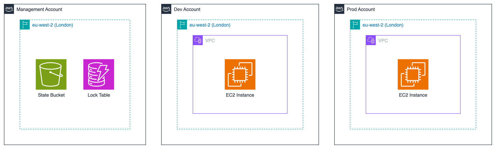

# AWS Account Structure

This project has 3 different AWS accounts for different purposes:

1. Management
2. Dev
3. Prod

## Diagram

## Management Account

This account is where the OpenTofu state locking infrastructure is deployed. This consists of:

1. S3 Bucket
2. DynamoDB Table

As mentioned <here>, Amazon-managed KMS keys have been used for encryption to stay within the free tier.

## Dev Account

This AWS account hosts the develop environment of the infrastructure we're building inside the project. This consists of:

1. Networking resources
   1. VPC
   2. Route Tables
   3. Subnets
   4. Security Groups
2. EC2 Instance
   1. To run Grafana

## Prod Account

This AWS account hosts the production environment of the infrastructure we're building inside the project. This consists of:

1. Networking resources
   1. VPC
   2. Route Tables
   3. Subnets
   4. Security Groups
2. EC2 Instance
   1. To run Grafana
