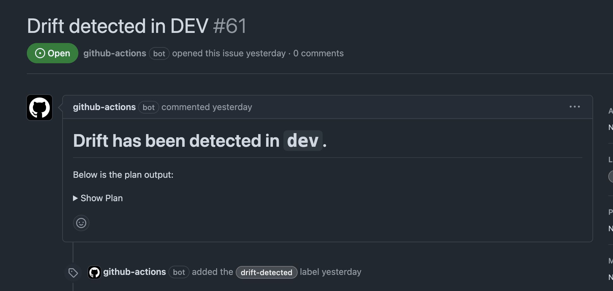

# Tofu Drift Check

This workflow creates a GitHub Issue if drift is detected on both the `dev` and `prod` environments. Drift is when the state of your infrastructure differs from the state known by OpenTofu.

## Workflow

``` { .yaml title=".github/workflows/drift_check.yml" linenums="1" }
--8<-- ".github/workflows/drift_check.yml"
```

## Configuration

This workflow runs every day at 5pm UTC time. This is configured using a `cron schedule`. Additionally, it uses the `workflow_dispatch: {}` keyword which allows the manual triggering of a workflow:

``` { .yaml title=".github/workflows/drift_check.yml" linenums="3" }
on:
  schedule:
    - cron: '0 17 * * *' #5pm every day
  workflow_dispatch: {}
```

This workflow needs permissions to:

1. Create GitHub Issues
2. Get the OIDC JWT Token to authenticate with AWS
      1. So OpenTofu can run a `tofu plan`
3. Checkout the base branch.

``` { .yaml title=".github/workflows/drift_check.yml" linenums="8" }
permissions:
  issues: write
  contents: read
  id-token: write
```

!!! info
    As all jobs need this permission, we defined it at the root of the workflow to avoid repeating for each job.

### Jobs

This workflow has two jobs:

1. [`dev`](#dev)
2. [`prod`](#prod)

#### dev

``` { .yaml title=".github/workflows/drift_check.yml" linenums="14" }
dev:
  runs-on: ubuntu-latest
  steps:
    - name: Check Out Code
      uses: actions/checkout@11bd71901bbe5b1630ceea73d27597364c9af683 # v4.2.2

    - name: Configure OpenTofu
      uses: opentofu/setup-opentofu@12f4debbf681675350b6cd1f0ff8ecfbda62027b # v1.0.4

    - name: Print Tofu Version
      run: tofu --version

    - name: Get OIDC Token File
      run: |
        curl -s -H "Authorization: bearer $ACTIONS_ID_TOKEN_REQUEST_TOKEN" "$ACTIONS_ID_TOKEN_REQUEST_URL&audience=sts.amazonaws.com" | jq -r .value > /tmp/web-identity-token

    - name: Tofu Init
      run: tofu init --backend-config="key=${{ github.event.repository.name }}/dev/terraform.tfstate" --var-file="dev.tfvars"
      working-directory: ${{ github.workspace }}/tofu
  
    - name: Tofu Plan
      id: plan-dev
      run: tofu plan --var-file="dev.tfvars" -no-color -detailed-exitcode -out=tfdev.plan
      working-directory: ${{ github.workspace }}/tofu

    - name: Create Issue if Drift Detected
      if: steps.plan-dev.outputs.exitcode == 2
      uses: actions/github-script@60a0d83039c74a4aee543508d2ffcb1c3799cdea # v7.0.1
      with:
        script: |
          const fs = require('fs');
          const { execSync } = require('child_process');

          // Get the terraform plan output
          const planOutput = execSync('tofu show -no-color tfdev.plan', {
            cwd: 'tofu'
          }).toString();

          const plan = planOutput.length > 65000 ? planOutput.substring(0, 65000) + " ..." : planOutput;

          const truncateMessage = planOutput.length > 65000 ? `> [!NOTE]\n> The plan output is too long so it has been truncated. You can view the full plan at: ${context.serverUrl}/${context.repo.owner}/${context.repo.repo}/actions/runs/${context.runId}` : "";

          const issueTitle = 'Drift detected in DEV';
          const issueBody = `# Drift has been detected in \`dev\`.\nBelow is the plan output:\n<details><summary>Show Plan</summary>\n\n\`\`\`hcl\n${plan}\n\`\`\`\n</details>\n\n${truncateMessage}`;
          const issues = await github.rest.issues.listForRepo({
            owner: context.repo.owner,
            repo: context.repo.repo,
            state: 'open',
            labels: 'drift-detected'
          });
          const issueExists = issues.data.some(issue => issue.title === issueTitle);
          if (!issueExists) {
            await github.rest.issues.create({
              owner: context.repo.owner,
              repo: context.repo.repo,
              title: issueTitle,
              body: issueBody,
              labels: ['drift-detected']
            });
          }
```

This job:

1. Checks out base branch
2. Configures/Install OpenTofu
3. Log the current OpenTofu version being used
      1. *This would be the latest version at the given time*
4. Get the OIDC JWT to authenticate with AWS
5. Initialise OpenTofu to download the `required_providers` in `provider.tf`
6. Run an OpenTofu Plan
7. Create a GitHub Issue if drift has been detected.

You might be thinking: "how are we detecting drift?" This is using the `-detailed-exitcode` flag of `tofu plan`. The exit code changes based on certain criteria:

!!! quote "Quote (*from opentofu.org*)"
    Returns a detailed exit code when the command exits. When provided, this argument changes the exit codes and their meanings to provide more granular information about what the resulting plan contains:
    
    - 0 = Succeeded with empty diff (no changes)
    - 1 = Error
    - 2 = Succeeded with non-empty diff (changes present)

As we're using the official OpenTofu action that puts a wrapper around OpenTofu, we can use the exit code output from the Action to determine if we should create an issue or not. We use `2` which indicates changes are present and therefore drift so we need to create a GitHub Issue. 

You can see an example below: 



**Presenting the Plan and the Plan Size**

I explained the rationale for this in the [Tofu Plan](./tofu_plan.md) page, but it is relevant here as well. We output a plan file using the `-out` parameter of the `tofu plan` command, then we use `tofu show -no-color` to present it ready for outputting in the issue. My JavaScript isn't the best, so I found a useful workflow by GitHub user: [tmlye](https://github.com/tmlye) that used the `execSync` function in JavaScript: <https://github.com/actions/runner/issues/1733#issuecomment-2447036317>. Here is where I hit my second issue, which if you looked at the title of the Issue in that comment will give you a little clue... "Argument list too long".

If you have a massive plan output, which doesn't necessarily mean a mass amount of resources, but one that returns a big object, such as the `data "http" "get" {}` data source using the HTTP provider, you could easily hit this limit. I hit it myself when using the exact same data source to check Grafana application availability using a `check` block.

I found an Issue online in which people came together to come up with a good solution to this problem. You can read more here: <https://github.com/actions/github-script/issues/266>. In short, we need to truncate the plan output:

``` { .js title=".github/workflows/drift_check.yml" linenums="44" }
const fs = require('fs');
const { execSync } = require('child_process');

// Get the terraform plan output
const planOutput = execSync('tofu show -no-color tfdev.plan', {
 cwd: 'tofu'
}).toString();

const plan = planOutput.length > 65000 ? planOutput.substring(0, 65000) + " ..." : planOutput;

const truncateMessage = planOutput.length > 65000 ? `> [!NOTE]\n> The plan output is too long so it has been truncated. You can view the full plan at: ${context.serverUrl}/${context.repo.owner}/${context.repo.repo}/actions/runs/${context.runId}` : "";

const issueTitle = 'Drift detected in DEV';
const issueBody = `# Drift has been detected in \`dev\`.\nBelow is the plan output:\n<details><summary>Show Plan</summary>\n\n\`\`\`hcl\n${plan}\n\`\`\`\n</details>\n\n${truncateMessage}`;
```

We convert the plan file into a string, and then use the `substring` function to take 65000 characters and append a ` ...`. If the plan file isn't more than 65000 characters long, we just use the full plan file. Using newer features in GitHub, we create a "Note" [admonition](https://github.com/orgs/community/discussions/16925) to alert the user that the plan has been truncated and they can view the full plan at the link created by the issue. This uses a concatenation of multiple `context` variables to dynamically create it.

You may also see that we use `-no-color` when using `tofu show`. This is because the "color" output is converted to the unicode equivalent, making the plan essentially unreadable. To add this back in, we use the `hcl` code identifier in the code block quote. I personally prefer seeing a colour output anyway and I imagine others do too!

Lastly, we use the `<details>` and `<summary>` tags which makes the plan output collapsible in the pull request. I actually prefer this because if you have a massive plan output, it makes the PR/Issue look all cluttered - especially if multiple are ran and your original comment in not updated! You can see this in the screenshot taken above where it says `> Show Plan`.

These improvements have also made there way to the generic Tofu Plan reusable workflow documented [here](./tofu_plan.md).


#### prod

``` { .yaml title=".github/workflows/drift_check.yml" linenums="75" }
prod:
  runs-on: ubuntu-latest
  steps:
    - name: Check Out Code
      uses: actions/checkout@11bd71901bbe5b1630ceea73d27597364c9af683 # v4.2.2

    - name: Configure OpenTofu
      uses: opentofu/setup-opentofu@12f4debbf681675350b6cd1f0ff8ecfbda62027b # v1.0.4

    - name: Print Tofu Version
      run: tofu --version

    - name: Get OIDC Token File
      run: |
        curl -s -H "Authorization: bearer $ACTIONS_ID_TOKEN_REQUEST_TOKEN" "$ACTIONS_ID_TOKEN_REQUEST_URL&audience=sts.amazonaws.com" | jq -r .value > /tmp/web-identity-token

    - name: Tofu Init
      run: tofu init --backend-config="key=${{ github.event.repository.name }}/prod/terraform.tfstate" --var-file="prod.tfvars"
      working-directory: ${{ github.workspace }}/tofu
  
    - name: Tofu Plan
      id: plan-prod
      run: tofu plan --var-file="prod.tfvars" -no-color -detailed-exitcode -out=tfprod.plan
      working-directory: ${{ github.workspace }}/tofu

    - name: Create Issue if Drift Detected
      if: steps.plan-prod.outputs.exitcode == 2
      uses: actions/github-script@60a0d83039c74a4aee543508d2ffcb1c3799cdea # v7.0.1
      with:
        script: |
          const fs = require('fs');
          const { execSync } = require('child_process');

          // Get the terraform plan output
          const planOutput = execSync('tofu show -no-color tfprod.plan', {
            cwd: 'tofu'
          }).toString();

          const plan = planOutput.length > 65000 ? planOutput.substring(0, 65000) + " ..." : planOutput;

          const truncateMessage = planOutput.length > 65000 ? `> [!NOTE]\n> The plan output is too long so it has been truncated. You can view the full plan at: ${context.serverUrl}/${context.repo.owner}/${context.repo.repo}/actions/runs/${context.runId}` : "";

          const issueTitle = 'Drift detected in PROD';
          const issueBody = `# Drift has been detected in \`prod\`.\nBelow is the plan output:\n<details><summary>Show Plan</summary>\n\n\`\`\`hcl\n${plan}\n\`\`\`\n</details>\n\n${truncateMessage}`;
          const issues = await github.rest.issues.listForRepo({
            owner: context.repo.owner,
            repo: context.repo.repo,
            state: 'open',
            labels: 'drift-detected'
          });
          const issueExists = issues.data.some(issue => issue.title === issueTitle);
          if (!issueExists) {
            await github.rest.issues.create({
              owner: context.repo.owner,
              repo: context.repo.repo,
              title: issueTitle,
              body: issueBody,
              labels: ['drift-detected']
            });
          }
```

This is basically the same as `dev` - just changing which plan file to take an output of :smile:

You can see the issue it creates on GitHub below:


