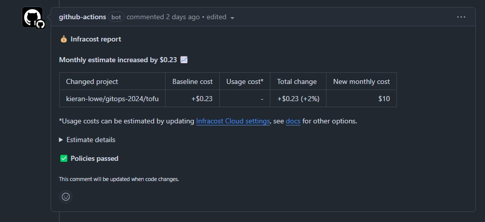
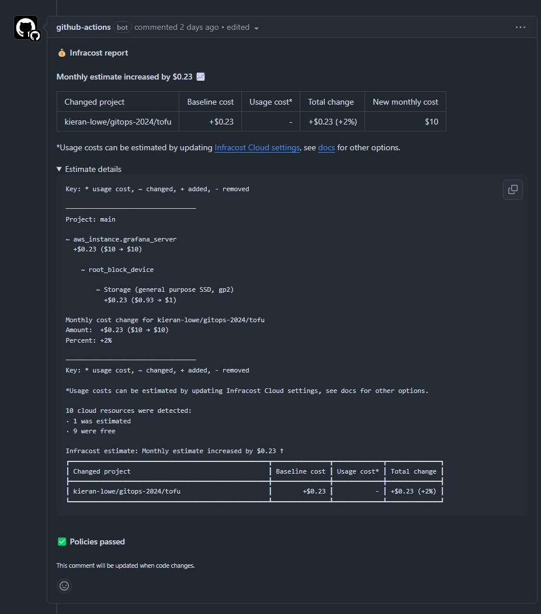

# Infracost

The Infracost job in the PR workflow checks how much the PR itself is going to cost. The workflow is just a job directly in the PR workflow. It also uses a Rego policy that is evaluated by the Open Policy Agent that checks if the PR will cost $10 or more, if it does it will fail the policy!

!!! note
    Normally I would put this in it's own workflow and make it reusable, I designed it this way so you could see how flexible GitHub Actions can be! You don't have to use reusable workflows, but in general I recommend doing so as we can all contribute towards a common codebase and everyone then leverages the benefits.

## Workflow

``` { .yaml title=".github/workflows/pr.yml" linenums="56" } 
infracost:
  runs-on: ubuntu-latest
  permissions:
    contents: read
    pull-requests: write
  steps:
    - name: Setup Infracost
      uses: infracost/actions/setup@e9d6e6cd65e168e76b0de50ff9957d2fe8bb1832 # v3.0.1
      with:
        api-key: ${{ secrets.INFRACOST_API_KEY }}

    - name: Checkout base branch
      uses: actions/checkout@11bd71901bbe5b1630ceea73d27597364c9af683 # v4.2.2
      with:
        ref: '${{ github.event.pull_request.base.ref }}'

    - name: Generate Infracost cost estimate baseline
      run: |
        infracost breakdown --path=. \
                            --format=json \
                            --out-file=/tmp/infracost-base.json \
                            --terraform-var-file "${{ github.base_ref == 'main' && 'prod' || 'dev' }}.tfvars"
      working-directory: ${{ github.workspace }}/tofu

    # Checkout the current PR branch so we can create a diff.
    - name: Checkout PR branch
      uses: actions/checkout@11bd71901bbe5b1630ceea73d27597364c9af683 # v4.2.2

    # Generate an Infracost diff and save it to a JSON file.
    - name: Generate Infracost diff
      run: |
        infracost diff --path=. \
                        --format=json \
                        --compare-to=/tmp/infracost-base.json \
                        --out-file=/tmp/infracost.json \
                        --terraform-var-file "${{ github.base_ref == 'main' && 'prod' || 'dev' }}.tfvars"
      working-directory: ${{ github.workspace }}/tofu

    - name: Post Infracost comment
      run: |
          infracost comment github --path=/tmp/infracost.json \
                                    --repo=$GITHUB_REPOSITORY \
                                    --github-token=${{ github.token }} \
                                    --pull-request=${{ github.event.pull_request.number }} \
                                    --behavior=update \
                                    --policy-path ./policies/cost.rego
```

## Configuration

This job requires additional permissions, as it places a comment on the PR we need to give it `write` permissions on `pull-requests` and `read` permissions on `contents` so it can checkout the base branch AND the PR branch. This is important so it can make a cost comparison!

Additionally, this is the first and only workflow that is making use of GitHub Action Secrets! In order for us to authenticate to the Infracost API, we need an API key. We store this in a secret named `INFRACOST_API_KEY` which is then passed to the workflow at runtime and is masked in any logs.

### Steps

This job has 6 steps:

1. [Setup Infracost](#setup-infracost)
2. [Checkout base branch](#checkout-base-branch)
3. [Generate Infracost cost estimate baseline](#generate-infracost-cost-estimate-baseline)
4. [Checkout PR branch](#checkout-pr-branch)
5. [Generate Infracost diff](#generate-infracost-diff)
6. [Post Infracost comment](#post-infracost-comment)

#### Setup Infracost

``` { .yaml title=".github/workflows/pr.yml" linenums="62" } 
- name: Setup Infracost
  uses: infracost/actions/setup@e9d6e6cd65e168e76b0de50ff9957d2fe8bb1832 # v3.0.1
  with:
    api-key: ${{ secrets.INFRACOST_API_KEY }}
```

We start by configuring and installing Infracost using their official GitHub Action. We pass in our API key that authenticates us with the API.

#### Checkout base branch

``` { .yaml title=".github/workflows/pr.yml" linenums="67" } 
- name: Checkout base branch
  uses: actions/checkout@11bd71901bbe5b1630ceea73d27597364c9af683 # v4.2.2
  with:
    ref: '${{ github.event.pull_request.base.ref }}'
```

Infracost has to make a comparison with what is existing somewhere, as a result it checkouts the base (target) branch of the repository to know what is existing today.

#### Generate Infracost cost estimate baseline

``` { .yaml title=".github/workflows/pr.yml" linenums="72" } 
- name: Generate Infracost cost estimate baseline
  run: |
    infracost breakdown --path=. \
                        --format=json \
                        --out-file=/tmp/infracost-base.json \
                        --terraform-var-file "${{ github.base_ref == 'main' && 'prod' || 'dev' }}.tfvars"
  working-directory: ${{ github.workspace }}/tofu
```

Once the base branch has been checked out, it then breaks it down in a format to use as a comparison later. As we pass in the `working-directory` directive, `.` translates to the `tofu/` directory where the configuration is stored in the repo via the `--path` flag. As we specify the volume size and instance type as part our variables, we pass in the var file to infracost so it generates an accurate breakdown.

#### Checkout PR branch

``` { .yaml title=".github/workflows/pr.yml" linenums="81" } 
- name: Checkout PR branch
  uses: actions/checkout@11bd71901bbe5b1630ceea73d27597364c9af683 # v4.2.2
```

Simply put, it checkouts the PR branch to learn about what changes are being made.

#### Generate Infracost diff

``` { .yaml title=".github/workflows/pr.yml" linenums="85" } 
- name: Generate Infracost diff
run: |
  infracost diff --path=. \
                  --format=json \
                  --compare-to=/tmp/infracost-base.json \
                  --out-file=/tmp/infracost.json \
                  --terraform-var-file "${{ github.base_ref == 'main' && 'prod' || 'dev' }}.tfvars"
working-directory: ${{ github.workspace }}/tofu
```

Now it has context of the two branches, it used the breakdown it generated in the 3rd step and compares it against the PR to generate the cost of any changes made.

#### Post Infracost comment

``` { .yaml title=".github/workflows/pr.yml" linenums="94" } 
- name: Post Infracost comment
  run: |
      infracost comment github --path=/tmp/infracost.json \
                                --repo=$GITHUB_REPOSITORY \
                                --github-token=${{ github.token }} \
                                --pull-request=${{ github.event.pull_request.number }} \
                                --behavior=update \
                                --policy-path ./policies/cost.rego
```

Before it posts the comment on GitHub as part of the PR. It uses Open Policy Agent integration to ensure the cost complies with any OPA policies we tell Infracost to compare against. The policy that we are telling infracost to use is:

``` { .rego title="policies/cost.rego" linenums="1" } 
--8<-- "policies/cost.rego"
```

The output is then posted as a comment on the PR, if any changes are made, it then updates the existing comment!

You can see an example below:




