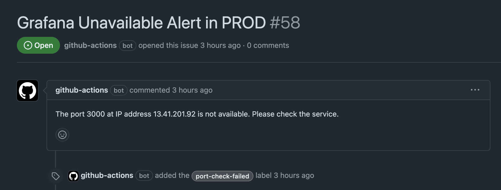

# Port Check

This workflow is used to check port availability of the Grafana instances in the `dev` and `prod` environments. It does a simple `curl` check to see if it can be accessed and if not, creates a GitHub Issue inside the repo.

## Workflow

``` { .yaml title=".github/workflows/port_check.yml" linenums="1" }
--8<-- ".github/workflows/port_check.yml"
```

## Configuration

This workflow runs every day at 5pm UTC time. This is configured using a `cron schedule`. Additionally, it uses the `workflow_dispatch: {}` keyword which allows the manual triggering of a workflow:

``` { .yaml title=".github/workflows/port_check.yml" linenums="3" }
on:
  schedule:
    - cron: '0 17 * * *'
  workflow_dispatch: {}
```

As it requires access to create Issues, we grant it the `permissions.issues: write` permission.

``` { .yaml title=".github/workflows/port_check.yml" linenums="8" }
permissions:
  issues: write
```

!!! info
    As all jobs need this permission, we defined it at the root of the workflow to avoid repeating for each job.

### Jobs

This workflow has two jobs:

1. [`dev`](#dev)
2. [`prod`](#prod)

#### dev

``` { .yaml title=".github/workflows/port_check.yml" linenums="12" }
dev:
  runs-on: ubuntu-latest
  steps:
  - name: Check port availability
    run: |
      IP_ADDRESS="35.178.137.32"
      PORT="3000"
      echo IP_ADDRESS_DEV="35.178.137.32" >> $GITHUB_ENV
      echo PORT="3000" >> $GITHUB_ENV

      if curl --silent --fail --max-time 20 --connect-timeout 10 "http://$IP_ADDRESS:$PORT"; then
        echo "Grafana is available in dev!"
      else
        echo "Grafana is NOT AVAILABLE in DEV!"
        echo "port_unavailable_dev=true" >> $GITHUB_ENV
      fi

  - name: Create Issue if Grafana is not available
    if: env.port_unavailable_dev == 'true'
    uses: actions/github-script@60a0d83039c74a4aee543508d2ffcb1c3799cdea # v7.0.1
    with:
      script: |
        const issueTitle = 'Grafana Unavailable Alert in DEV';
        const issueBody = `The port ${{ env.PORT }} at IP address ${{ env.IP_ADDRESS_DEV }} is not available. Please check the service.`;
        const issues = await github.rest.issues.listForRepo({
          owner: context.repo.owner,
          repo: context.repo.repo,
          state: 'open',
          labels: 'port-check-failed'
        });
        const issueExists = issues.data.some(issue => issue.title === issueTitle);
        if (!issueExists) {
          await github.rest.issues.create({
            owner: context.repo.owner,
            repo: context.repo.repo,
            title: issueTitle,
            body: issueBody,
            labels: ['port-check-failed']
          });
        }
```

The `$GITHUB_ENV` environment variable is used to pass variables too which can be later referenced in additional steps and their configurations. For example: `echo IP_ADDRESS="35.178.137.32" >> $GITHUB_ENV` and using the `env` context: `env.port_unavailable_dev == 'true'` for the next step. 

This means the `Create Issue if Grafana is not available` step only runs if the `if` condition returns `true`. This step simply takes the IP Address and Port it tried to connect and create a GitHub Issue. It uses Javascript to call the REST API.

#### prod

``` { .yaml title=".github/workflows/port_check.yml" linenums="53" }
prod:
  runs-on: ubuntu-latest
  steps:
  - name: Check port availability
    run: |
      IP_ADDRESS="13.41.201.92"
      PORT="3000"
      echo IP_ADDRESS_PROD="13.41.201.92" >> $GITHUB_ENV
      echo PORT="3000" >> $GITHUB_ENV

      if curl --silent --fail --max-time 20 --connect-timeout 10 "http://$IP_ADDRESS:$PORT"; then
        echo "Grafana is available in prod!"
      else
        echo "Grafana is NOT AVAILABLE in PROD!"
        echo "port_unavailable_prod=true" >> $GITHUB_ENV
      fi
      

  - name: Create Issue if Grafana is not available
    if: env.port_unavailable_prod == 'true'
    uses: actions/github-script@60a0d83039c74a4aee543508d2ffcb1c3799cdea # v7.0.1
    with:
      script: |
        const issueTitle = 'Grafana Unavailable Alert in PROD';
        const issueBody = `The port ${{ env.PORT }} at IP address ${{ env.IP_ADDRESS_PROD }} is not available. Please check the service.`;
        const issues = await github.rest.issues.listForRepo({
          owner: context.repo.owner,
          repo: context.repo.repo,
          state: 'open',
          labels: 'port-check-failed'
        });
        const issueExists = issues.data.some(issue => issue.title === issueTitle);
        if (!issueExists) {
          await github.rest.issues.create({
            owner: context.repo.owner,
            repo: context.repo.repo,
            title: issueTitle,
            body: issueBody,
            labels: ['port-check-failed']
          });
        }
```

This is basically the same as `dev` with the IP address changing to reflect the production environment. If the IP and Port is not available, then it creates a GitHub Issue.

You can see an example below:


