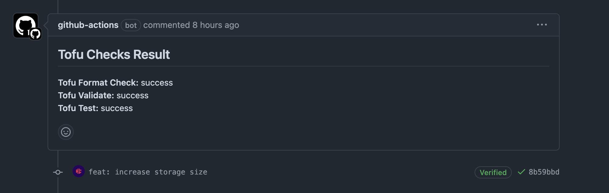

# Tofu Checks

The purpose of the Tofu Checks workflow is to ensure that the code is:

1. Code is formatted to the canonical OpenTofu standards
2. The configuration is validated
3. Custom tests pass

## Calling Workflow

``` { .yaml title=".github/workflows/pr.yml" linenums="20" }
jobs:
  tofu-checks:
    permissions:
      contents: read
      id-token: write
      pull-requests: write
    uses: ./.github/workflows/tofu_checks.yml
    with:
      tf_var_file: "${{ github.base_ref == 'main' && 'prod' || 'dev' }}.tfvars"
```

## Workflow

``` { .yaml title=".github/workflows/tofu_checks.yml" linenums="1" }
--8<-- ".github/workflows/tofu_checks.yml"
```

!!! info
    This workflow uses a different `on:` keyword option, `workflow_call` - this means it can be called by another workflow only!

## Configuration

Within the workflow, there are two inputs:

1. `tf_var_file`
      1. Path to the `.tfvars` file to be used in `tofu` operations via `-var-file`
2. `test_directory`
      1. The directory that stores the `*.tftest.hcl` files that `tofu test` runs

This is all controlled via: 

``` { .yaml title=".github/workflows/tofu_checks.yml" linenums="3" }
on:
  workflow_call:
    inputs:
      tf_var_file:
        required: true
        type: string
      test_directory:
        required: false
        type: string
        default: "tests"
```

This workflow also implements some environment variables, that are present to all jobs and their associated steps in the workflow. This is controlled via the [`env` keyword](https://docs.github.com/en/actions/writing-workflows/choosing-what-your-workflow-does/accessing-contextual-information-about-workflow-runs#env-context). These are:

``` { .yaml title=".github/workflows/tofu_checks.yml" linenums="18" }
env:
  TF_IN_AUTOMATION: "true"
  TF_INPUT: "false"
```

These environment variables are used by OpenTofu to influence how information is presented by the tool, for example in CI/CD pipelines.

### Jobs

This workflow has 4 jobs:

1. [`fmt`](#fmt)
2. [`validate`](#validate)
3. [`test`](#test)
4. [`post-comment`](#post-comment)

#### fmt

``` { .yaml title=".github/workflows/tofu_checks.yml" linenums="23" }
fmt:
 runs-on: ubuntu-latest
 steps:
   - name: Check Out Code
     uses: actions/checkout@11bd71901bbe5b1630ceea73d27597364c9af683 # v4.2.2
     with:
         ref: ${{ github.event.pull_request.head.ref }}

   - name: Configure OpenTofu
     uses: opentofu/setup-opentofu@12f4debbf681675350b6cd1f0ff8ecfbda62027b # v1.0.4

   - name: Print Tofu Version
     run: tofu --version

   - name: Tofu Format Check
     run: tofu fmt --check
     working-directory: ${{ github.workspace }}/tofu
```

This job installs OpenTofu, prints the version using `tofu --version` and then runs the `tofu fmt --check` command inside the `tofu/` directory. The use of `${{ github.workspace }}` is a context variable, which in this case points to the root of the repo.

!!! info
    `working-directory` is not specific to OpenTofu, in fact it's a keyword in the GitHub Actions syntax in which you can easily specify which directory to run a step in!

    ``` { .yaml title=".github/workflows/tofu_checks.yml" linenums="39" }
    working-directory: ${{ github.workspace }}/tofu
    ```

#### validate

``` { .yaml title=".github/workflows/tofu_checks.yml" linenums="41" }
validate:
 runs-on: ubuntu-latest
 steps:
   - name: Check Out Code
     uses: actions/checkout@11bd71901bbe5b1630ceea73d27597364c9af683 # v4.2.2
     with:
         ref: ${{ github.event.pull_request.head.ref }}

   - name: Configure OpenTofu
     uses: opentofu/setup-opentofu@12f4debbf681675350b6cd1f0ff8ecfbda62027b # v1.0.4

   - name: Print Tofu Version
     run: tofu --version
     working-directory: ${{ github.workspace }}/tofu

   - name: Tofu Init
     run: tofu init --backend=false
     working-directory: ${{ github.workspace }}/tofu

   - name: Tofu Validate
     run: tofu validate
     working-directory: ${{ github.workspace }}/tofu
```

This is very similar to the `fmt` workflow, with the exception we are using `tofu init` and `tofu validate`. This checks to ensure the OpenTofu configuration is valid, but requires `tofu init` to be ran so the providers can be downloaded!

!!! tip
    You can use the `--backend=false` flag in your init command to speed up this step when using `tofu validate`. This is because we don't need to connect to the remote state file in S3 for `tofu validate` to work.

#### test

``` { .yaml title=".github/workflows/tofu_checks.yml" linenums="64" }
test:
 runs-on: ubuntu-latest
 steps:
   - name: Check Out Code
     uses: actions/checkout@11bd71901bbe5b1630ceea73d27597364c9af683 # v4.2.2
     with:
         ref: ${{ github.event.pull_request.head.ref }}

   - name: Configure OpenTofu
     uses: opentofu/setup-opentofu@12f4debbf681675350b6cd1f0ff8ecfbda62027b # v1.0.4

   - name: Print Tofu Version
     run: tofu --version

   - name: Get OIDC Token File
     run: |
       curl -s -H "Authorization: bearer $ACTIONS_ID_TOKEN_REQUEST_TOKEN" "$ACTIONS_ID_TOKEN_REQUEST_URL&audience=sts.amazonaws.com" | jq -r .value > /tmp/web-identity-token

   - name: Tofu Init
     run: tofu init -backend=false
     working-directory: ${{ github.workspace }}/tofu

   - name: Tofu Test
     id: test
     run: tofu test -var-file="${{ inputs.tf_var_file }}" -test-directory="${{ inputs.test_directory }}"
     working-directory: ${{ github.workspace }}/tofu
```

Like other jobs, we're configuring OpenTofu, initialising it and now running `tofu test` - OpenTofu's native testing framework. However you may notice this one job has an additional step - getting the OIDC Token File using `curl`. This is because we need to authenticate with our role in AWS for some of these tests to work. 

!!! info
    You might be wondering why I'm not using the official AWS action to authenticate to AWS The reason why I'm using this, and not the official AWS action to authenticate is explained <here>

#### post-comment

``` { .yaml title=".github/workflows/tofu_checks.yml" linenums="91" }
post-comment:
  runs-on: ubuntu-latest
  needs: [fmt, validate, test]
  steps:
    - name: Post Comment
      uses: actions/github-script@60a0d83039c74a4aee543508d2ffcb1c3799cdea # v7.0.1
      with:
        script: |
          const fmtResult = `**Tofu Format Check:** ${{ needs.fmt.result }}`;
          const validateResult = `**Tofu Validate:** ${{ needs.validate.result }}`;
          const testResult = `**Tofu Test:** ${{ needs.test.result }}`;
          const commentBody = `## Tofu Checks Result\n\n${fmtResult}\n${validateResult}\n${testResult}`;

          const { data: comments } = await github.rest.issues.listComments({
            owner: context.repo.owner,
            repo: context.repo.repo,
            issue_number: context.issue.number,
          });

          const botComment = comments.find(comment => comment.user.login === 'github-actions[bot]' && comment.body.includes("## Tofu Checks Result"));

          if (!botComment) {
            await github.rest.issues.createComment({
              owner: context.repo.owner,
              repo: context.repo.repo,
              issue_number: context.issue.number,
              body: commentBody,
            });
          } else {
            await github.rest.issues.updateComment({
              owner: context.repo.owner,
              repo: context.repo.repo,
              comment_id: botComment.id,
              body: commentBody,
            });
          }
```

This job requires the other steps to be completed first and this is by design. You will see the workflow uses the `needs` keyword, meaning that the other jobs need to be completed before `post-comment` can be ran. It takes the output of the other 3 jobs and whether they succeeded, or failed. It then uses `actions/github-script` to run some Javascript that posts the results to the PR. 

You can see an example below:


