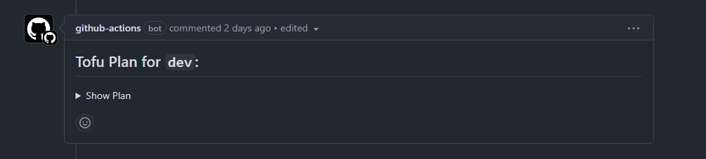
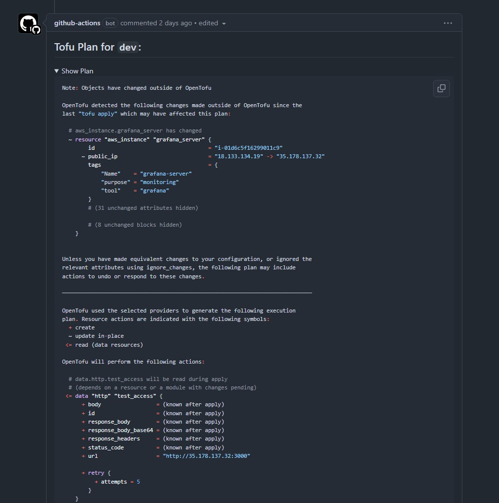

# Tofu Plan

This workflow crates a plan, which is what OpenTofu wants to do with your infrastructure. In that it compares the state vs your actual configuration. This is reusable, meaning it can be called by other workflows, in this case it is called by the PR workflow.

Once the plan has been created it is outputted to the PR.

## Calling Workflow

``` { .yaml title=".github/workflows/pr.yml" linenums="29" } 
tofu-plan:
  permissions:
    contents: read
    id-token: write
    pull-requests: write
  uses: ./.github/workflows/tofu_plan.yml
  with:
    environment: ${{ github.base_ref == 'main' && 'prod' || 'dev' }}
    tf_var_file: "${{ github.base_ref == 'main' && 'prod' || 'dev' }}.tfvars"
```

## Workflow

``` { .yaml title=".github/workflows/tofu_plan.yml" linenums="1" } 
--8<-- ".github/workflows/tofu_plan.yml"
```

## Configuration

This workflow has two inputs:

1. `environment`
    1. The environment to deploy the infrastructure inside
2. `tf_var_file`
    1. The var file to use for the deployment into `environment`

We also use two environment variables that influence how the output of OpenTofu is tailored to the system it is running in:

1. `TF_IN_AUTOMATION`
2. `TF_INPUT`

### Jobs

This workflow has one job:

1. [plan](#plan)

#### plan

``` { .yaml title=".github/workflows/tofu_plan.yml" linenums="22" } 
plan:
  runs-on: ubuntu-latest
  steps:
    - name: Check Out Code
      uses: actions/checkout@11bd71901bbe5b1630ceea73d27597364c9af683 # v4.2.2
      with:
          ref: ${{ github.event.pull_request.head.ref }}

    - name: Configure OpenTofu
      uses: opentofu/setup-opentofu@12f4debbf681675350b6cd1f0ff8ecfbda62027b # v1.0.4

    - name: Print Tofu Version
      run: tofu --version

    - name: Get OIDC Token File
      run: |
        curl -s -H "Authorization: bearer $ACTIONS_ID_TOKEN_REQUEST_TOKEN" "$ACTIONS_ID_TOKEN_REQUEST_URL&audience=sts.amazonaws.com" | jq -r .value > /tmp/web-identity-token

    - name: Tofu Init
      run: tofu init --backend-config="key=${{ github.event.repository.name }}/${{ inputs.environment }}/terraform.tfstate" --var-file="${{ inputs.tf_var_file }}"
      working-directory: ${{ github.workspace }}/tofu

    - name: Tofu Plan
      id: plan
      run: tofu plan --var-file="${{ inputs.tf_var_file }}" -no-color -detailed-exitcode -out=tf.plan
      working-directory: ${{ github.workspace }}/tofu

    - name: Output Tofu Plan in PR Comment
      uses: actions/github-script@60a0d83039c74a4aee543508d2ffcb1c3799cdea # v7.0.1
      with:
        script: |
          const fs = require('fs');
          const { execSync } = require('child_process');

          const planOutput = execSync('tofu show -no-color tf.plan', {
            cwd: 'tofu'
          }).toString();

          const plan = planOutput.length > 65000 ? planOutput.substring(0, 65000) + " ..." : planOutput;
          const truncateMessage = planOutput.length > 65000 ? `> [!NOTE]\n> The plan output is too long so it has been truncated. You can view the full plan at: ${context.serverUrl}/${context.repo.owner}/${context.repo.repo}/actions/runs/${context.runId}` : "";
          const commentBody = `## Tofu Plan for \`${{ github.base_ref == 'main' && 'prod' || 'dev' }}\`:\n<details><summary>Show Plan</summary>\n\n\`\`\`hcl\n${plan}\n\`\`\`\n</details>\n\n${truncateMessage}`;

          const { data: comments } = await github.rest.issues.listComments({
            owner: context.repo.owner,
            repo: context.repo.repo,
            issue_number: context.payload.number,
          });

          const botComment = comments.find(comment => comment.user.id === 41898282 && comment.body.includes("## Tofu Plan for"));

          if (!botComment) {
            github.rest.issues.createComment({
              issue_number: context.issue.number,
              owner: context.repo.owner,
              repo: context.repo.repo,
              body: commentBody,
            });
          } else {
            github.rest.issues.updateComment({
              owner: context.repo.owner,
              repo: context.repo.repo,
              comment_id: botComment.id,
              body: commentBody,
            });
          }
```

It clones the PR branch and configures OpenTofu, by default it will install the latest version available at runtime. After which the version is printed into the workflow logs and then we use `curl` to get the OIDC JWT file to be used by OpenTofu which allow us to assume an IAM role into the AWS accounts.

!!! note
    You may notice I'm not using the official AWS action here to authenticate with AWS, this is explained further in [OpenTofu Workflow](../tofu_workflow.md).

We initialise OpenTofu to download the providers and configure access to the remote S3 backend for storing the state file. We then run `tofu plan` to create a plan and store that in a plan file.

!!! note
    We are not actually using the plan file when we get to the [Tofu Apply](./tofu_apply.md) stage. It is used when we output the plan to the PR after we do some checks on it regarding length. 
    
    One improvement I want to make to this is to use the plan file at the `apply` stage as this can speed up the pipeline amongst giving you other benefits. This is explained further in the [OpenTofu Workflow](../tofu_workflow.md) page

**Presenting the Plan and the Plan Size**

I explained the rationale for this in the [Tofu Plan](./tofu_plan.md) page, but it is relevant here as well. We output a plan file using the `-out` parameter of the `tofu plan` command, then we use `tofu show -no-color` to present it ready for outputting in the issue. My JavaScript isn't the best, so I found a useful workflow by GitHub user: [tmlye](https://github.com/tmlye) that used the `execSync` function in JavaScript: <https://github.com/actions/runner/issues/1733#issuecomment-2447036317>. Here is where I hit my second issue, which if you looked at the title of the Issue in that comment will give you a little clue... "Argument list too long".

If you have a massive plan output, which doesn't necessarily mean a mass amount of resources, but one that returns a big object, such as the `data "http" "get" {}` data source using the HTTP provider, you could easily hit this limit. I hit it myself when using the exact same data source to check Grafana application availability using a `check` block.

I found an Issue online in which people came together to come up with a good solution to this problem. You can read more here: <https://github.com/actions/github-script/issues/266>. In short, we need to truncate the plan output:

``` { .js title=".github/workflows/tofu_plan.yml" linenums="53" }
const fs = require('fs');
const { execSync } = require('child_process');

const planOutput = execSync('tofu show -no-color tf.plan', {
  cwd: 'tofu'
}).toString();

const plan = planOutput.length > 65000 ? planOutput.substring(0, 65000) + " ..." : planOutput;
const truncateMessage = planOutput.length > 65000 ? `> [!NOTE]\n> The plan output is too long so it has been truncated. You can view the full plan at: ${context.serverUrl}/${context.repo.owner}/${context.repo.repo}/actions/runs/${context.runId}` : "";
const commentBody = `## Tofu Plan for \`${{ github.base_ref == 'main' && 'prod' || 'dev' }}\`:\n<details><summary>Show Plan</summary>\n\n\`\`\`hcl\n${plan}\n\`\`\`\n</details>\n\n${truncateMessage}`;
```

We convert the plan file into a string, and then use the `substring` function to take 65000 characters and append a ` ...`. If the plan file isn't more than 65000 characters long, we just use the full plan file. Using newer features in GitHub, we create a "Note" [admonition](https://github.com/orgs/community/discussions/16925) to alert the user that the plan has been truncated and they can view the full plan at the link created by the issue. This uses a concatenation of multiple `context` variables to dynamically create it.

You may also see that we use `-no-color` when using `tofu show`. This is because the "color" output is converted to the unicode equivalent, making the plan essentially unreadable. To add this back in, we use the `hcl` code identifier in the code block quote. I personally prefer seeing a colour output anyway and I imagine others do too!

Lastly, we use the `<details>` and `<summary>` tags which makes the plan output collapsible in the pull request. I actually prefer this because if you have a massive plan output, it makes the PR/Issue look all cluttered - especially if multiple are ran and your original comment in not updated! You can see this in the screenshot taken above where it says `> Show Plan`.

All this is then presented as a comment to the Pull Request. If another commit happens on the PR, the plan is ran again (assuming the commit updated a file in the `tofu` directory) and the comment updates.

You can see an example below:




