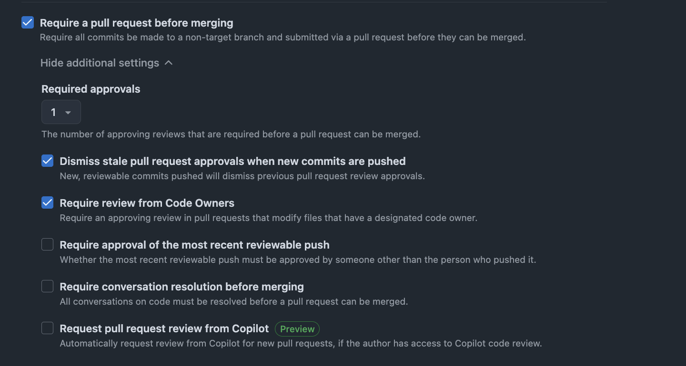
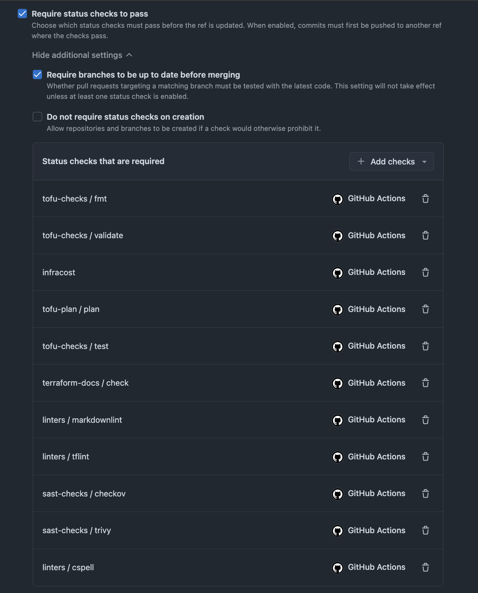
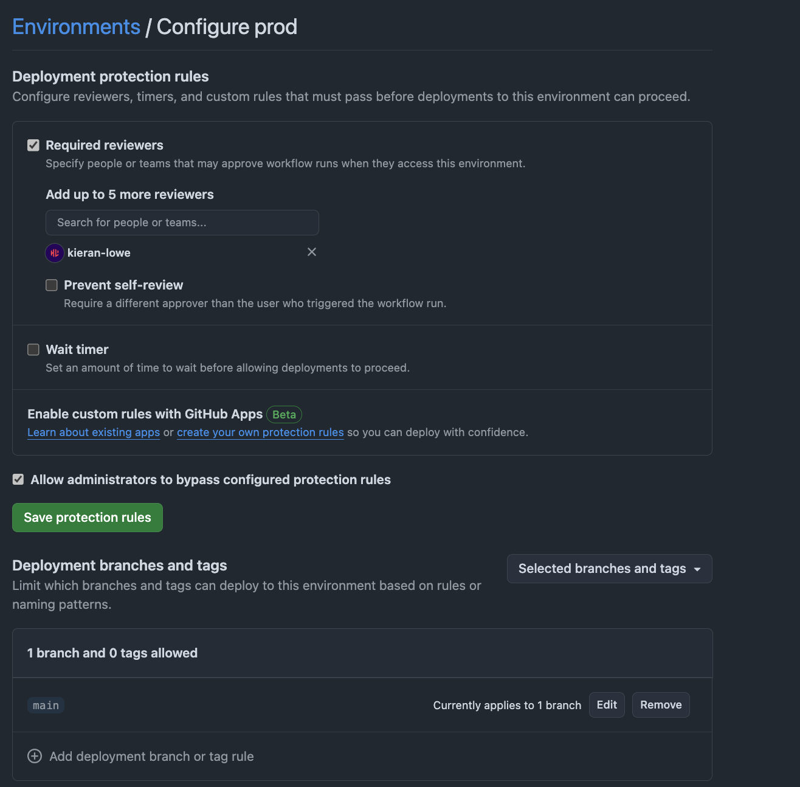

# Repo Settings

To implement guardrails in branches for this project we used some native GitHub Functionality to meet the requirements of the bootcamp.

## Rulesets

This project has two rulesets that have been created:

1. `dev`
2. `prod`

### `dev`

This ruleset applies to the `dev` branch, meaning specific criteria has to be completed before anything can be merged into it. These are:

1. Require a pull request before merging
2. Require status checks to pass

#### Pull Request before Merging

Before anything can be pushed into `dev` it MUST come from a pull request. Additionally, the pull request has to be approved by at least one approver. This approver must come from the Code Owners (this is defined in `.github/CODEOWNERS`).

#### Require status checks to pass

In addition to the above, status checks need to pass before it's possible to merge into `dev`. These checks are basically all the workflows I've created and documented on this site.

Only once both of the above are met, is it possible for a pull request to be merged into `dev`

### `prod`

Now prod, or `main`, implements exactly the same protections as `dev` above, with one addition:

1. Require deployments to succeed

#### Require Deployments to Succeed

`tofu apply` only runs in the context of a GitHub Environment. Only if a successful deployment into the `dev` GitHub Environment - meaning a ***successful*** `tofu apply` in `dev`, is it possible for a `prod` or `main` deployment.

To be clear, it uses the SAME protections as `dev` in that a PR must be made before merging AND status checks need to pass. It's just this one addition is also added for `prod`.

## GitHub Environments

This repository also implements GitHub Environments, and these are used in this project to ensure human intervention is required before a `tofu apply` or `tofu destroy` is allowed to run. We specify certain reviewers that are allowed to approve a workflow to run in `dev` and `prod` GitHub environments. In addition, only the related branch is allowed to deploy into that environment. So for the `prod` GitHub Environment that is `main` and for the `dev` GitHub Environment that is the `dev` branch.

You can see a screenshot of how this is implemented in `prod` but it's the same for `dev` - just obviously only allowing the `dev` branch.

