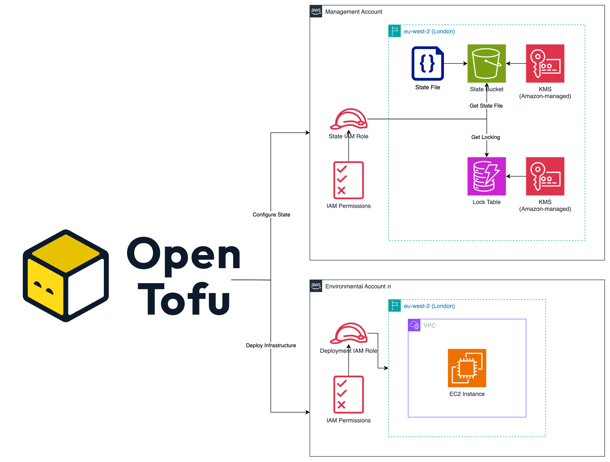

# OpenTofu Workflow

OpenTofu was used to deploy the infrastructure defined via the bootcamp. I believe passionately in Open Source, and thought this project was the perfect opportunity to use it for the first time! This page covers the workflow I created for this project, and goes over why I made the decisions I did.

## State Management

To manage the state file, we are using the native S3 backend for storage. Followed by DynamoDB for the state locking. Amazon managed encryption keys were used to encrypt the bucket and table.

!!! info
    In a customer/production situation, I would create dedicated CMKs (customer managed keys). However, I wanted to keep this in the free tier as much as possible.

A decision I made here is using separate IAM roles for managing the state file and the deployment of infrastructure. This means we can better adhere to the principal of least privilege as we wouldn't need to give the deployment role (the role that Terraform assumes to actually *deploy* infrastructure) permissions to also use the state file. This is super useful if you store your state file in a separate AWS account and is easy to implement. OpenTofu and Terraform can have two distinct authentication mechanisms:

1. Accessing the state file (using the `backend "s3" {}` block)
2. Deploying resources (using the `provider "aws" {}` block)

If you don't explicitly configure the state file authentication, the authentication you configure at the `provider` level is used to access the `backend`.

### Diagram

A diagram has been created below showing how the state file management has been configured along with a high level *n* account (e.g. dev, test, prod etc.) to show the separation.

!!! info
    The rest of the workflow follows the traditional write, plan and apply workflow. You can find more information about this on OpenTofu's website: <https://opentofu.org/docs/intro/core-workflow/>
