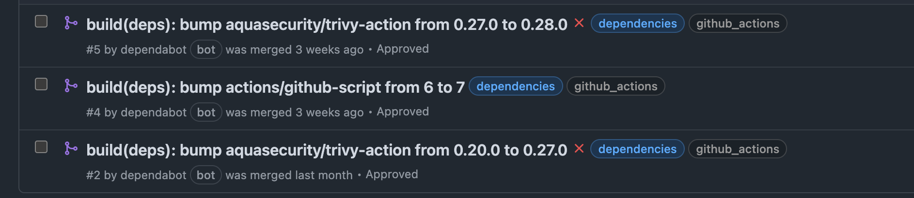

# What's Next?

This Minicamp has been amazing for me! I've dabbled in GitHub Actions before and actively continue to do so, but it was amazing putting it to the test and creating something actually tangible. Given the time I had, I've created so much. However, I've already identified improvements I would love to make and will continue to do so in my own time. I'm explaining some of them below!

## Caching Providers

OpenTofu Providers are ***big***, hundreds of megabytes! The AWS OpenTofu Provider 5.74 Linux AMD64 version is 603.80MB in fact. Instead of downloading these each time, it would be good to cache them as opposed to downloading them each time. Especially in frequent runs.

## Use the OpenTofu Plan File Approach

I've explained this in [OpenTofu Workflow](./tofu_workflow.md) but will show an excerpt below:

!!! quote
    Throughout this Minicamp we create the plan file but don't actually use it when it comes to the `tofu apply` - we could do this using the upload artifact and download artifact GitHub Actions but in general it is best practice to encrypt it as it may contain sensitive information, or anything you might "deem" sensitive. You can actually do this in OpenTofu itself now natively, it's one of the key differentiators when compared directly with Terraform. The benefit of the plan file approach is that OpenTofu doesn't do another `plan` when you `apply`. When you specify `--auto-approve` OpenTofu generates another plan and then executes it. This has two potential issues:
    
    1. Speed - Using the plan file from the `plan` step you can execute the changes much quicker as there's no need for a second "plan".
    2. Guarantee of Changes - Depending on the time gap between the plan running and then someone approving the workflow to apply the changes, someone could have made some manual changes that were not captured in that first plan. Normally if you execute an `apply` right after the `plan` this is unlikely, but sometimes you might go a few hours or potentially days if you waiting to do a change based on any change management process.

## Apply Before Merge

Again, I've explained this further in the [Merging Strategy](./repository/merging_strategy.md), but will show an excerpt below:

!!! quote

## Implement ChatOps

One thing I'm seeing a lot lately in industry is using "ChatOps" - where we can influence CI/CD in our PRs using "slash commands", such as:

1. `/replan`
2. `/apply`

Which could run a new Terraform Plan and apply directly in the PR itself, also known as "Apply before Merge" as discussed above. I would like to explore this behaviour and implement it. In fact I did try for this Minicamp, but due to time I didn't implement it.

## Create PR Comment following Apply

Another nice quality of life improvement to this would be to create a comment on the PR following the `tofu apply` step. Once the apply has been ran from the PR that generated the event.

## Workflow Refactoring

My reusable workflows are very much tailored to my specific Minicamp implementation, so while they are reusable for "me", I would like to make them more generic where possible so others could use them. However in saying that, there are loads of workflows out there that are already adopted by communities as the "defacto" standard. One example that springs to mind is my use if `github-script` to post comments to PRs. There's Actions out there that do this for you and abstract the complexity away from you. I wanted to push myself and my own learning in keeping as close to official, native Actions where possible but I'm all for not reinventing the wheel. If something already exists, I'd much rather build on it and contribute anything back so others can leverage!

## Repo Management in OpenTofu

I created the repo on the console manually, I would like to have the repo and the associated settings managed by OpenTofu itself using the GitHub provider. Given more time, I would have done this, and I can easily do so by importing it into Terraform.

## checkov Workflow

I mentioned in the [SAST Tooling](./github_action_workflows/sast.md) page that the official Checkov action hasn't been updated in a very long time, and even using one major version out-of-date version of checkov. One easy improvement I could make is to create a new one and manage it through `pip`.

## checkov Sarif Output

checkov can output the results into a sarif format. This could then be uploaded to the "Security" tab of the repository if using GitHub Advanced Security. I'd need to check, but public repos get it enabled automatically I think, so this could be easy to implement!

## Generate OPA Policies

Currently I have only one OPA policy that Infracost uses to check the cost of a PR doesn't exceed $10. It would be good to generate further policies, such as:

1. Making sure 0.0.0.0/0 isn't exposed on Port 22 (SSH)
2. Only certain instance types are allowed

Yes, you could technically use OpenTofu variable validation, pre and postconditions in modules to enforce this, but I feel OPA gives a more agnostic way of adhering to a common set of policies. Whether you are using modules that enforce these or not - you'll be assessed against the same standard.

## Grafana Port Check Workflow Improvements

Currently the workflow is hardcoding the IP addresses, which means I have an external dependency. It would be good to store the IPs somewhere, such as SSM Parameter Store in AWS which is free, and have it dynamically get them at runtime. As I'm writing this, I could easily use workflow variables or/and even give access to the state file using `outputs` to get the information too. This should be easy to integrate.

## Dependabot

I have dabbled with this already, and got it working in the repo as you can see below for creating PRs on new versions of Workflows:

but I would like to deep dive into this more and see what is possible, such as AWS Provider Version upgrades and more!
